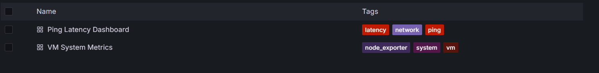

# System Monitoring with Prometheus, Grafana, and Node Exporter and Ping
- In monitor host (for measuring testbed) install docker like the  step 1 and: 
```bash
docker run -d \
  --name=node_exporter \
  --net="host" \
  prom/node-exporter:latest
```
- In node to build monitor to collect metrics
## Step 1: Install docker 
```bash
sudo apt-get update -y
sudo apt-get upgrade -y


sudo apt-get install -y apt-transport-https ca-certificates curl software-properties-common


curl -fsSL https://download.docker.com/linux/ubuntu/gpg | sudo apt-key add -


sudo add-apt-repository \
   "deb [arch=amd64] https://download.docker.com/linux/ubuntu \
   $(lsb_release -cs) stable"

sudo apt-get update -y
sudo apt-get install -y docker-ce docker-ce-cli containerd.io

sudo usermod -aG docker $USER
```

## Step 2: Create directory monitor and write docker-compose
```bash
mkdir -p ~/monitoring
cd ~/monitoring
```
- Write docker compose 
```bash
version: "3.7"

services:
  prometheus:
    image: prom/prometheus:latest
    container_name: prometheus
    volumes:
      - ./prometheus.yml:/etc/prometheus/prometheus.yml
    ports:
      - "9090:9090"
    restart: always

  grafana:
    image: grafana/grafana:latest
    container_name: grafana
    ports:
      - "3000:3000"
    environment:
      - GF_SECURITY_ADMIN_USER=admin
      - GF_SECURITY_ADMIN_PASSWORD=admin
    depends_on:
      - prometheus
    restart: always

  node_exporter:
    image: prom/node-exporter:latest
    container_name: node_exporter
    ports:
      - "9100:9100"
    restart: always
  blackbox_exporter:
    image: prom/blackbox-exporter:latest
    container_name: blackbox_exporter
    ports:
      - "9115:9115"
    restart: always
```
- Trong cùng thư mục ~/monitoring tạo prometheus.yml 
```bash
global:
  scrape_interval: 15s

scrape_configs:
  - job_name: "prometheus"
    static_configs:
      - targets: ["prometheus:9090"]

  - job_name: "node_exporter"
    static_configs:
      - targets: ["node_exporter:9100", "160.191.101.131:9100"]
  - job_name: "ping"
    metrics_path: /probe
    params:
      module: [icmp]   
    static_configs:
      - targets:
          - 160.191.101.131   # VM to monitor ping
    relabel_configs:
      - source_labels: [__address__]
        target_label: __param_target
      - source_labels: [__param_target]
        target_label: instance
      - target_label: __address__
        replacement: blackbox_exporter:9115
```

## Step 3: Start Prometheus Container
```bash
docker compose up -d
```
- Check status of container
## Step 4: Verify Integration
- Access Prometheus Web UI: Open your browser and go to http://localhost:9090. (if using public IP using it instead of localhost)
- Check Targets: Navigate to the “Targets” page in the Prometheus UI. You should see both ‘prometheus’ and ‘node-exporter’ listed as targets, indicating successful integration.
- Grafana: http://localhost:3000 (or IP public if using them) (user/pass: admin/admin)
## Step 5: Visualize data
```bash
Choose connection -> data sources -> choose Prometheus -> enter Prometheus server URL and Save.
Go to Grafana → Dashboards → Import 
```
- Paste this With uid is the name of data source 
```bash
{
  "annotations": {
    "list": [
      {
        "builtIn": 1,
        "datasource": {
          "type": "prometheus",
          "uid": "prometheus"
        },
        "enable": true,
        "hide": true,
        "iconColor": "rgba(0, 211, 255, 1)",
        "name": "Annotations & Alerts",
        "type": "dashboard"
      }
    ]
  },
  "editable": true,
  "fiscalYearStartMonth": 0,
  "graphTooltip": 0,
  "id": 1,
  "links": [],
  "panels": [
    {
      "datasource": {
        "type": "prometheus",
        "uid": "prometheus"
      },
      "fieldConfig": {
        "defaults": {
          "color": {
            "mode": "palette-classic"
          },
          "unit": "percent"
        }
      },
      "gridPos": {
        "h": 8,
        "w": 12,
        "x": 0,
        "y": 0
      },
      "id": 1,
      "options": {
        "legend": {
          "displayMode": "list",
          "placement": "bottom",
          "showLegend": true
        },
        "tooltip": {
          "mode": "single"
        }
      },
      "pluginVersion": "12.1.1",
      "targets": [
        {
          "expr": "100 - (avg by (instance) (rate(node_cpu_seconds_total{mode=\"idle\", instance=~\"$instance\"}[1m])) * 100)",
          "legendFormat": "{{instance}} CPU Usage",
          "refId": "A"
        }
      ],
      "title": "CPU Usage (%)",
      "type": "timeseries"
    },
    {
      "datasource": {
        "type": "prometheus",
        "uid": "prometheus"
      },
      "fieldConfig": {
        "defaults": {
          "unit": "percent"
        }
      },
      "gridPos": {
        "h": 8,
        "w": 12,
        "x": 12,
        "y": 0
      },
      "id": 2,
      "options": {
        "legend": {
          "displayMode": "list",
          "placement": "bottom",
          "showLegend": true
        }
      },
      "pluginVersion": "12.1.1",
      "targets": [
        {
          "expr": "(1 - (node_memory_MemAvailable_bytes{instance=~\"$instance\"} / node_memory_MemTotal_bytes{instance=~\"$instance\"})) * 100",
          "legendFormat": "{{instance}} Memory Usage",
          "refId": "A"
        }
      ],
      "title": "Memory Usage (%)",
      "type": "timeseries"
    },
    {
      "datasource": {
        "type": "prometheus",
        "uid": "prometheus"
      },
      "fieldConfig": {
        "defaults": {
          "unit": "percent"
        }
      },
      "gridPos": {
        "h": 8,
        "w": 12,
        "x": 0,
        "y": 8
      },
      "id": 3,
      "options": {
        "legend": {
          "displayMode": "list",
          "placement": "bottom",
          "showLegend": true
        }
      },
      "pluginVersion": "12.1.1",
      "targets": [
        {
          "expr": "(1 - (node_filesystem_avail_bytes{fstype!=\"tmpfs\",fstype!=\"overlay\", instance=~\"$instance\"} / node_filesystem_size_bytes{fstype!=\"tmpfs\",fstype!=\"overlay\", instance=~\"$instance\"})) * 100",
          "legendFormat": "{{instance}} {{mountpoint}}",
          "refId": "A"
        }
      ],
      "title": "Disk Usage (%)",
      "type": "timeseries"
    },
    {
      "datasource": {
        "type": "prometheus",
        "uid": "prometheus"
      },
      "fieldConfig": {
        "defaults": {
          "unit": "short"
        }
      },
      "gridPos": {
        "h": 8,
        "w": 12,
        "x": 12,
        "y": 8
      },
      "id": 4,
      "options": {
        "legend": {
          "displayMode": "list",
          "placement": "bottom",
          "showLegend": true
        }
      },
      "pluginVersion": "12.1.1",
      "targets": [
        {
          "expr": "node_load1{instance=~\"$instance\"}",
          "legendFormat": "{{instance}} Load 1m",
          "refId": "A"
        }
      ],
      "title": "Load Average (1m)",
      "type": "timeseries"
    }
  ],
  "refresh": "10s",
  "schemaVersion": 41,
  "tags": [
    "node_exporter",
    "system",
    "vm"
  ],
  "templating": {
    "list": [
      {
        "current": {
          "text": "160.191.101.131:9100",
          "value": "160.191.101.131:9100"
        },
        "datasource": {
          "type": "prometheus",
          "uid": "prometheus"
        },
        "name": "instance",
        "query": "label_values(node_cpu_seconds_total, instance)",
        "refresh": 1,
        "sort": 1,
        "type": "query"
      }
    ]
  },
  "time": {
    "from": "now-15m",
    "to": "now"
  },
  "timezone": "",
  "title": "VM System Metrics",
  "uid": "vm-system-metrics",
  "version": 3
}
```


- If  want to download metric with CSV style, In the upper right corner of the panel → click the panel title choose Inspect → Data and dowload csv form

- Create new dashboard and import
```bash
{
  "annotations": {
    "list": [
      {
        "builtIn": 1,
        "datasource": {
          "type": "prometheus",
          "uid": "prometheus"
        },
        "enable": true,
        "hide": true,
        "iconColor": "rgba(0, 211, 255, 1)",
        "name": "Annotations & Alerts",
        "type": "dashboard"
      }
    ]
  },
  "editable": true,
  "fiscalYearStartMonth": 0,
  "graphTooltip": 0,
  "id": null,
  "links": [],
  "panels": [
    {
      "datasource": {
        "type": "prometheus",
        "uid": "prometheus"
      },
      "fieldConfig": {
        "defaults": {
          "color": {
            "mode": "palette-classic"
          },
          "mappings": [],
          "thresholds": {
            "mode": "absolute",
            "steps": [
              {
                "color": "green",
                "value": null
              },
              {
                "color": "red",
                "value": 1
              }
            ]
          }
        },
        "overrides": []
      },
      "gridPos": {
        "h": 4,
        "w": 4,
        "x": 0,
        "y": 0
      },
      "id": 1,
      "options": {
        "colorMode": "value",
        "graphMode": "none",
        "justifyMode": "center",
        "orientation": "auto",
        "reduceOptions": {
          "calcs": [
            "lastNotNull"
          ],
          "fields": "",
          "values": false
        },
        "textMode": "auto"
      },
      "pluginVersion": "10.4.2",
      "targets": [
        {
          "expr": "probe_success{instance=~\"$instance\"}",
          "legendFormat": "Success",
          "refId": "A"
        }
      ],
      "title": "Ping Status",
      "type": "stat"
    },
    {
      "datasource": {
        "type": "prometheus",
        "uid": "prometheus"
      },
      "fieldConfig": {
        "defaults": {
          "color": {
            "mode": "palette-classic"
          },
          "custom": {
            "axisCenteredZero": false,
            "axisColorMode": "text",
            "axisLabel": "",
            "axisPlacement": "auto",
            "barAlignment": 0,
            "drawStyle": "line",
            "fillOpacity": 10,
            "gradientMode": "none",
            "hideFrom": {
              "legend": false,
              "tooltip": false,
              "viz": false
            },
            "lineInterpolation": "linear",
            "lineWidth": 2,
            "pointSize": 4,
            "scaleDistribution": {
              "type": "linear"
            },
            "showPoints": "auto",
            "spanNulls": false,
            "stacking": {
              "group": "A",
              "mode": "none"
            },
            "thresholdsStyle": {
              "mode": "off"
            }
          },
          "mappings": [],
          "thresholds": {
            "mode": "absolute",
            "steps": [
              {
                "color": "green",
                "value": null
              },
              {
                "color": "red",
                "value": 200
              }
            ]
          },
          "unit": "ms"
        },
        "overrides": []
      },
      "gridPos": {
        "h": 10,
        "w": 20,
        "x": 4,
        "y": 0
      },
      "id": 2,
      "options": {
        "legend": {
          "calcs": [],
          "displayMode": "list",
          "placement": "bottom",
          "showLegend": true
        },
        "tooltip": {
          "mode": "single",
          "sort": "none"
        }
      },
      "pluginVersion": "10.4.2",
      "targets": [
        {
          "expr": "probe_icmp_duration_seconds{instance=~\"$instance\", phase=\"rtt\"} * 1000",
          "legendFormat": "{{instance}} RTT",
          "refId": "A"
        }
      ],
      "title": "Ping Latency (ms)",
      "type": "timeseries"
    }
  ],
  "refresh": "30s",
  "schemaVersion": 38,
  "style": "dark",
  "tags": ["ping", "network", "latency"],
  "templating": {
    "list": [
      {
        "current": {
          "selected": false,
          "text": "160.191.101.131",
          "value": "160.191.101.131"
        },
        "datasource": {
          "type": "prometheus",
          "uid": "prometheus"
        },
        "definition": "label_values(probe_success, instance)",
        "hide": 0,
        "includeAll": false,
        "label": "Instance",
        "multi": false,
        "name": "instance",
        "options": [],
        "query": {
          "query": "label_values(probe_success, instance)",
          "refId": "Prometheus-instance-Variable-Query"
        },
        "refresh": 1,
        "regex": "",
        "skipUrlSync": false,
        "sort": 0,
        "type": "query"
      }
    ]
  },
  "time": {
    "from": "now-15m",
    "to": "now"
  },
  "timepicker": {},
  "timezone": "",
  "title": "Ping Latency Dashboard",
  "uid": "ping-latency",
  "version": 1,
  "weekStart": ""
}

```


